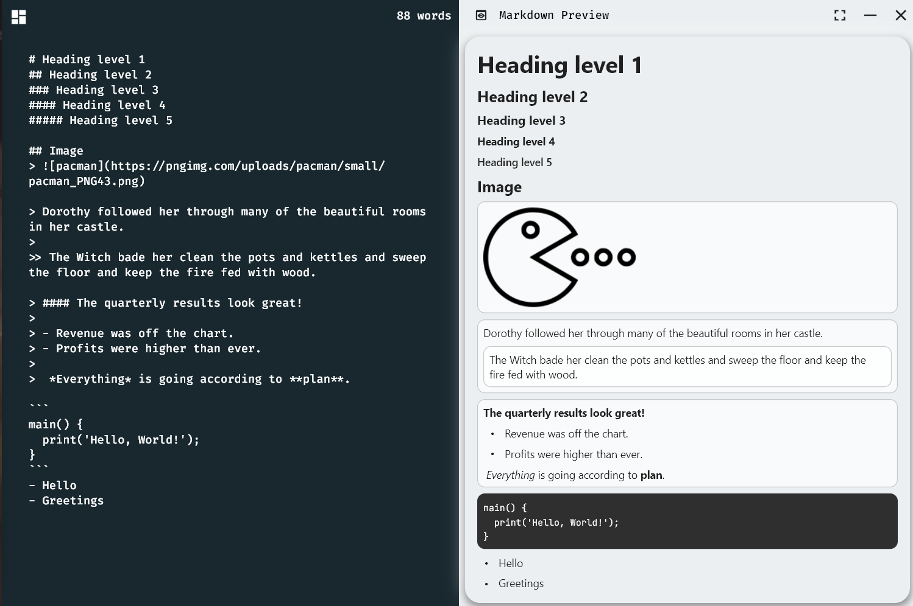

 
# MarkDown.ED
 >An Open source desktop Markdown Editor made using flutter.
 >
 >The license of this project is General Public License(GPL).
- ----
## ScreenShots

- ---- 
## Features
The editor has the following **features**:
-   Real-time synchronization preview
-   Upload local image
-   Multiple markdown standards support :
    - Markdown
	- Strict Markdown
	- Github Markdown
-   Ability to export to multiple file type:
	- pdf
- Modern Style
- Full screen support
- ----
## Download
>[All Release]()
- ---
## Dev
For a WPF project, I recommend VS2015 Community Edition to Build.
- ---
## Thanks

- [flutter_markdown](https://github.com/flutter/flutter_markdown?ref=morioh.com&utm_source=morioh.com)
- [bitsdojo](https://github.com/bitsdojo/bitsdojo_window)
- [commonmark](https://github.com/commonmark/commonmark-spec)